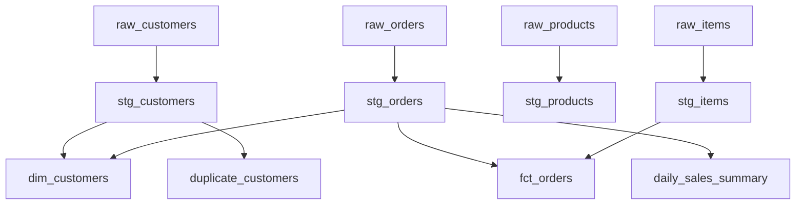

# 🏗️ Models in dbt

## 🎯 What are Models?

Models are the **core building blocks** of dbt projects. At their essence, models are:

- **SQL SELECT statements** saved as `.sql` files in your `models/` directory
- **Transformations** that take raw data and convert it into analysis-ready datasets
- **Materializations** that can be created as tables, views, or incremental tables in your data warehouse
- **Dependencies** that reference other models using the `{{ ref() }}` function
    - In dbt, sources and refs serve a similar purpose to DNS in web infrastructure. Just like DNS translates human-friendly domain names into IP addresses—ensuring that if a website's physical server changes, users can still access it without needing to know its new IP—dbt's sources and refs abstract the underlying table names and locations. This means that if the location or name of a table changes in the data warehouse, models and analyses referencing it through ref or source continue to work without modification. This abstraction promotes modularity, flexibility, and maintainability, just as DNS simplifies and stabilizes internet navigation.

## 🔄 How Models Work

When you run `dbt run`, dbt:

1. **Reads** your model SQL files
2. **Compiles** them into executable SQL (resolving `{{ ref() }}` functions)
3. **Executes** the SQL in your data warehouse
4. **Materializes** the results as tables or views
5. **Tracks dependencies** to run models in the correct order

## 📝 Model Anatomy

Every dbt model follows this basic structure:

```sql
-- Model configuration (optional)
{{ config(materialized='table') }}

-- SQL SELECT statement
SELECT
    column1,
    column2,
    calculated_field
FROM {{ ref('source_model') }}
WHERE condition = true
```

## 🏛️ Model Architecture

Our dbt project follows a three-layer architecture:

```
📁 models/
├── 📁 staging/     # Data cleaning and standardization
├── 📁 analytics/   # Business logic and dimensional modeling  
└── 📁 marts/       # Final business-ready datasets
```

### **Layer 1: Staging Models** 🧹

Staging models perform initial data cleaning and standardization. They're the foundation that ensures consistent, reliable data for downstream models.

#### **`stg_customers.sql`**
- **Purpose**: Cleans and standardizes customer data
- **Key transformations**:
  - Trims whitespace from names and addresses
  - Validates and standardizes email formats
  - Cleans phone numbers using custom macro `clean_phone()`
  - Adds validation flags (`has_valid_email`, `has_valid_phone`)

```sql
-- Example transformation
CASE 
    WHEN email LIKE '%@%'
        THEN LOWER(TRIM(email))
END AS email,
COALESCE(email LIKE '%@%', FALSE) AS has_valid_email
```

#### **`stg_orders.sql`**
- **Purpose**: Standardizes order data and adds business logic flags
- **Key transformations**:
  - Validates and cleans monetary amounts
  - Standardizes status values (`LOWER(TRIM(status))`)
  - Adds business flags (`is_high_value_order`, `is_fulfilled`)
  - Handles null dates and invalid amounts

#### **`stg_products.sql`**
- **Purpose**: Cleans product catalog data
- **Key transformations**: Product name standardization, price validation

#### **`stg_items.sql`**
- **Purpose**: Standardizes order line items
- **Key transformations**: Quantity validation, price calculations

### **Layer 2: Analytics Models** 📊

Analytics models contain business logic and implement dimensional modeling patterns.

#### **`dim_customers.sql`**
- **Purpose**: Creates a comprehensive customer dimension with behavioral metrics
- **Key features**:
  - Aggregates customer order history
  - Calculates customer lifetime value metrics
  - Includes order frequency and recency analysis

```sql
-- Customer metrics example
COUNT(o.order_id) AS total_orders,
SUM(o.total_amount) AS total_spent,
AVG(o.total_amount) AS avg_order_value
```

#### **`fct_orders.sql`**
- **Purpose**: Creates a fact table for order analysis
- **Key features**:
  - Combines order header with item-level aggregations
  - Calculates order-level metrics (total items, quantities)
  - Links to customer dimension

### **Layer 3: Marts Models** 🏪

Marts contain business-ready datasets optimized for specific use cases.

#### **`daily_sales_summary.sql`**
- **Purpose**: Provides daily sales reporting and trend analysis
- **Key features**:
  - Daily revenue aggregations
  - Order count and customer metrics by day
  - Time series data for dashboards

#### **`duplicate_customers.sql`**
- **Purpose**: Data quality mart identifying potential duplicate customers
- **Key features**: Customer deduplication analysis

## 🔗 Model Dependencies

Understanding model dependencies is crucial for maintaining your dbt project:



## 💡 Best Practices Demonstrated

### **1. Naming Conventions**
- **Staging**: `stg_[entity]` (e.g., `stg_customers`)
- **Dimensions**: `dim_[entity]` (e.g., `dim_customers`)
- **Facts**: `fct_[process]` (e.g., `fct_orders`)
- **Marts**: `descriptive_name` (e.g., `daily_sales_summary`)

### **2. SQL Style**
- CTEs (Common Table Expressions) for readability
- Consistent indentation and formatting
- Descriptive column aliases
- Comments for complex logic

### **3. Data Quality**
- Input validation in staging models
- Business rule enforcement
- NULL handling strategies
- Data type consistency

### **4. Modularity**
- Single responsibility per model
- Clear separation of concerns
- Reusable transformations via macros

## 🛠️ Working with Models

### **Running Models**
```bash
# Run all models
dbt run

# Run specific model
dbt run --select stg_customers

# Run models and downstream dependencies
dbt run --select stg_customers+

# Run staging layer only
dbt run --select staging
```

### **Testing Models**
```bash
# Test all models
dbt test

# Test specific model
dbt test --select dim_customers
```

## 🎯 Key Takeaways

1. **Layered architecture** promotes maintainability and code reuse
2. **Staging models** should focus on cleaning and standardization
3. **Analytics models** implement business logic and dimensional modeling
4. **Marts** provide business-ready datasets for specific use cases
5. **Clear naming conventions** make projects easier to navigate
6. **Consistent SQL style** improves readability and maintainability

---

**Next**: Learn how to implement [Tests](tests.md) to ensure data quality across all your models!
