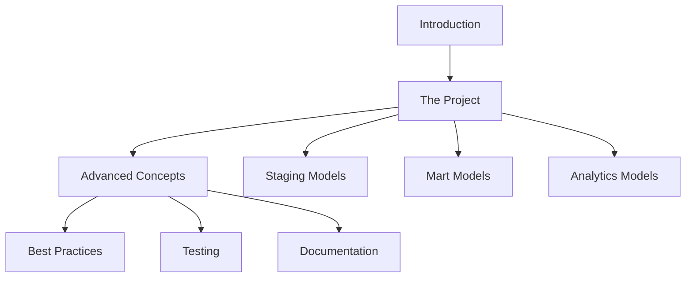

# 🚀 dbt Course

Welcome to the practical **dbt (data build tool)** course using a database inspired by the **Jaffle Shop** project!

## 📚 About the Course

This course is designed to teach the fundamental and advanced concepts of dbt through a practical and realistic project.
It's based on the Jaffle Shop project, which simulates an online store, allowing you to learn dbt with data that makes sense in the real world.

## 🎯 What You'll Learn

- ✅ **dbt Fundamentals**: Basic concepts, installation and configuration
- ✅ **Project Structure**: Organization of models, tests and documentation
- ✅ **Data Modeling**: Staging, marts and analytical models
- ✅ **Testing & Quality**: Data quality assurance
- ✅ **Macros & Reusability**: Reusable and maintainable code
- ✅ **Documentation**: Creating rich and interactive documentation
- ✅ **Best Practices**: Industry standards and best practices

## 🏪 The Project

The Jaffle Shop is a fictional online store that sells various products. The project includes:

- **Customers**: Demographic and contact information
- **Products**: Product catalog with categories
- **Orders**: Transactions and sold items
- **Analytics**: Business metrics and reports

## 🚀 Getting Started

1. **Project Setup**: [Project Setup](jaffle-shop/project-setup.md)
2. **Exploring Jaffle Shop**: [Project Overview](jaffle-shop/overview.md)

## 🛠️ Prerequisites

- Basic SQL knowledge
- Familiarity with data warehousing concepts
- Python 3.8+ installed
- Git for version control

## 📖 Course Structure

## 🔗 Useful Links

- [Official dbt Documentation](https://docs.getdbt.com/)
- [dbt Community](https://community.getdbt.com/)
- [dbt Slack](https://community.getdbt.com/slack)
- [Project GitHub](https://github.com/tjsoliveira/dbt_course)

## 🤝 Contributing

This course is open source! Contributions are welcome:

- 🐛 Report bugs
- 💡 Suggest improvements
- 📝 Fix errors
- 🌟 Add new examples

## 📄 License

This project is licensed under the MIT License - see the LICENSE file for details.

---

**Ready to start your dbt journey?** 🎉

Let's start with [project setup](jaffle-shop/project-setup.md)!