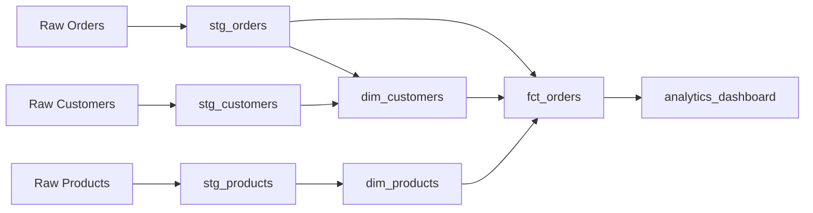

# 🤔 What is dbt?

dbt (data build tool) is a modern data engineering tool that enables data analysts and engineers to transform data in their warehouse more effectively.

## 🎯 What dbt Does

dbt is a **transformation tool** that sits between your data warehouse and your analytics tools. It allows you to:

- **Transform raw data** into clean, structured datasets
- **Build data models** using SQL
- **Test data quality** automatically
- **Document your data** comprehensively
- **Version control** your data transformations
- **Collaborate** with team members

## 🏗️ How dbt Works

### 1. **Extract & Load** (Not dbt's job)
- Data is extracted from source systems
- Loaded into your data warehouse (Snowflake, BigQuery, Redshift, etc.)

### 2. **Transform** (dbt's specialty)
- Raw data is transformed into clean, business-ready datasets
- Transformations are written in SQL
- dbt compiles and runs these transformations

### 3. **Serve** (Analytics tools)
- Clean data is served to BI tools, notebooks, and applications

## 🔑 Key Concepts

### Models
SQL files that define transformations:
```sql
-- models/staging/stg_customers.sql
SELECT
    id,
    first_name,
    last_name,
    email,
    created_at
FROM {{ source('raw', 'customers') }}
WHERE email IS NOT NULL
```

### Sources
References to raw data tables:
```yaml
# models/sources.yml
sources:
  - name: raw
    database: analytics
    schema: raw_data
    tables:
      - name: customers
      - name: orders
```

### Tests
Data quality checks:
```yaml
# models/schema.yml
models:
  - name: stg_customers
    columns:
      - name: id
        tests:
          - unique
          - not_null
      - name: email
        tests:
          - not_null
          - unique
```

### Macros
Reusable SQL code:
```sql
-- macros/clean_phone.sql

    REGEXP_REPLACE({{ phone_column }}, '[^0-9]', '')

```

## 🏪 Why Use dbt?

### For Data Analysts
- **SQL-first**: Write transformations in familiar SQL
- **Version control**: Track changes to your data models
- **Documentation**: Auto-generate documentation
- **Testing**: Ensure data quality automatically

### For Data Engineers
- **Modularity**: Build reusable, maintainable models
- **Dependencies**: Manage complex data pipelines
- **CI/CD**: Integrate with modern development practices
- **Scalability**: Handle large datasets efficiently

### For Organizations
- **Collaboration**: Multiple team members can work together
- **Standards**: Enforce consistent naming and patterns
- **Governance**: Track data lineage and usage
- **Efficiency**: Reduce time spent on data preparation

## 🚀 dbt vs. Traditional ETL

| Traditional ETL | dbt |
|----------------|-----|
| GUI-based tools | Code-based |
| Limited testing | Comprehensive testing |
| Hard to version control | Git integration |
| Difficult collaboration | Team-friendly |
| Vendor lock-in | Database agnostic |

## 🔧 dbt Flavors

### dbt Core (Open Source)
- Free and open source
- Command-line interface
- Self-hosted
- Full functionality

### dbt Cloud (Hosted)
- Managed service by dbt Labs
- Web-based interface
- Built-in scheduling
- Team collaboration features

## 📊 Real-World Example

Here's how dbt transforms raw e-commerce data:



## 🎯 When to Use dbt

### ✅ Great for:
- Data warehousing projects
- Analytics engineering
- Data transformation pipelines
- Team collaboration on data
- SQL-based transformations

### ❌ Not ideal for:
- Real-time streaming data
- Complex data processing (use Spark/Flink)
- Non-SQL transformations
- Simple one-off data cleaning

## 🚀 Getting Started

Ready to start with dbt? Here's your path:

1. **Learn the basics**: [Environment Setup](setup.md)
2. **Setup the project**: [Project Setup](../jaffle-shop/project-setup.md)
3. **Build real models**: [Jaffle Shop Project](../jaffle-shop/overview.md)
4. **Master advanced concepts**: Advanced Concepts

## 🔗 Learn More

- [Official dbt Documentation](https://docs.getdbt.com/)
- [dbt Community](https://community.getdbt.com/)
- [dbt Blog](https://www.getdbt.com/blog/)
- [dbt YouTube Channel](https://www.youtube.com/c/dbtlabs)

---

**dbt is transforming how organizations work with data.** 🚀

Ready to join the revolution? Start with [environment setup](setup.md)!

