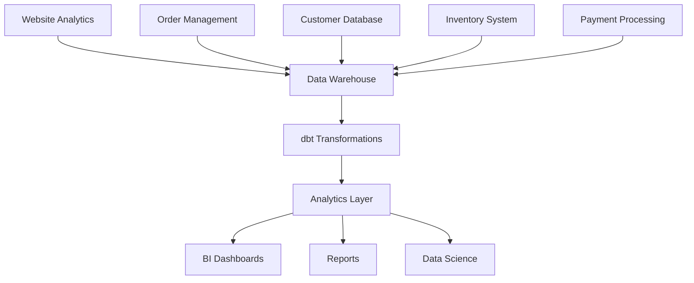

# 🏪 Project Overview

The Jaffle Shop is a fictional e-commerce company that serves as the perfect learning environment for dbt. This project simulates real-world data scenarios you'll encounter in actual business environments.

## 🎯 Project Goals

- **Learn dbt fundamentals** through hands-on practice
- **Understand data modeling** patterns and best practices
- **Build real data pipelines** from raw data to analytics
- **Practice testing and documentation** techniques
- **Experience team collaboration** workflows

## 🏗️ Business Context

### Company Profile
- **Industry**: E-commerce / Online Retail
- **Products**: Various consumer goods (electronics, furniture, clothing)
- **Customers**: Individual consumers and small businesses
- **Sales Channels**: Online store, mobile app, third-party marketplaces

### Key Business Metrics
- Customer acquisition and retention
- Product performance and inventory
- Order fulfillment and customer satisfaction
- Revenue growth and profitability
- Marketing campaign effectiveness

## 📊 Data Architecture

### Data Sources


### Data Flow
1. **Raw Data**: Extracted from source systems
2. **Staging**: Cleaned and standardized
3. **Marts**: Business-ready datasets
4. **Analytics**: Aggregated metrics and KPIs

## 🗄️ Data Models

### Staging Layer (`staging/`)
Raw data that has been cleaned and standardized:

- **`stg_customers`**: Customer information with data quality checks
- **`stg_orders`**: Order details with validation
- **`stg_products`**: Product catalog with categorization
- **`stg_items`**: Order line items with pricing

### Marts Layer (`marts/`)
Business-ready datasets for specific domains:

- **`daily_sales_summary`**: Daily sales performance metrics
- **`duplicate_customers`**: Analysis of potential duplicate customer records

### Analytics Layer (`analytics/`)
Aggregated metrics and business KPIs:

- **`dim_customers`**: Customer dimension table with aggregated metrics
- **`fct_orders`**: Order fact table with business logic and data quality checks


## 🔧 Technical Implementation

### Database
- **Primary**: SQLite (for learning)
- **Production**: PostgreSQL, Snowflake, or BigQuery
- **Schema**: Normalized design with proper relationships

### dbt Configuration
```yaml
# dbt_project.yml
models:
  jaffle_shop:
    staging:
      +materialized: view
      +schema: staging
    marts:
      +materialized: table
      +schema: marts
    analytics:
      +materialized: table
      +schema: analytics
```

### Data Quality
- **Generic tests**: uniqueness, not null, relationships
- **Custom tests**: business logic validation
- **Data profiling**: automatic documentation
- **Monitoring**: alerting on data issues

## 📚 Learning Path

### Beginner Level
1. **Setup**: Install dbt and configure environment
2. **Staging Models**: Clean and validate raw data
3. **Basic Tests**: Ensure data quality
4. **Documentation**: Document your models

### Intermediate Level
1. **Mart Models**: Build business-ready datasets
2. **Advanced Tests**: Custom validation logic
3. **Macros**: Reusable transformation code
4. **Dependencies**: Manage model relationships

### Advanced Level
1. **Analytics Models**: Complex business metrics
2. **Performance**: Optimize query performance
3. **Monitoring**: Production data quality

## 🎯 Project Deliverables

### Code Artifacts
- Complete dbt project structure
- All transformation models
- Comprehensive test suite
- Documentation and schemas

### Business Insights
- Customer behavior analysis
- Product performance metrics
- Operational efficiency data
- Revenue and growth analytics

### Technical Skills
- dbt project management
- SQL transformation expertise
- Data modeling best practices
- Testing and documentation

## 🚀 Getting Started

Ready to dive into the Jaffle Shop project?

1. **Project Setup**: [Project Setup](project-setup.md)
2. **What is dbt**: [Introduction to dbt](../intro/what-is-dbt.md)

## 🔍 Project Files

The complete project structure includes:

```
jaffle_shop/
├── models/
│   ├── staging/
│   │   ├── stg_customers.sql
│   │   ├── stg_orders.sql
│   │   ├── stg_products.sql
│   │   ├── stg_items.sql
│   │   └── staging.yml
│   ├── marts/
│   │   ├── daily_sales_summary.sql
│   │   ├── duplicate_customers.sql
│   │   └── marts.yml
│   └── analytics/
│       ├── dim_customers.sql
│       ├── fct_orders.sql
│       └── analytics.yml
├── tests/
├── macros/
├── seeds/
└── snapshots/
```

## 🌟 Success Metrics

You'll know you've mastered this project when you can:

- ✅ **Build models** that transform raw data into insights
- ✅ **Write tests** that catch data quality issues
- ✅ **Document models** that others can understand
- ✅ **Collaborate** with team members effectively
- ✅ **Deploy** changes safely and reliably

---

Ready to start building? Let's begin with [project setup](project-setup.md)!

