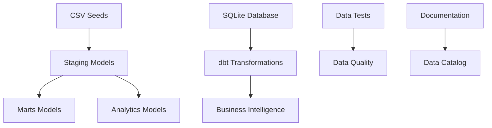

# 🚀 Project Setup

This comprehensive guide will help you set up and run the dbt project from scratch.

## 📋 Prerequisites

### **Required Software:**
- **Python 3.8+** - [Download here](https://python.org)
- **Git** - [Download here](https://git-scm.com)
- **Code editor** (recommended: VS Code or Cursor)

### **Recommended Knowledge:**
- Basic SQL
- Data warehousing concepts
- Basic command line

## 🏗️ Project Architecture

The project uses a typical **layered architecture** for dbt projects:



### **Directory Structure:**
```
jaffle_shop/
├── models/                    # dbt Models
│   ├── staging/              # Clean and standardized data
│   │   ├── stg_customers.sql
│   │   ├── stg_orders.sql
│   │   ├── stg_products.sql
│   │   ├── stg_items.sql
│   │   └── staging.yml       # Tests and documentation
│   ├── marts/                # Business-ready datasets
│   │   ├── daily_sales_summary.sql
│   │   ├── duplicate_customers.sql
│   │   └── marts.yml
│   └── analytics/            # Aggregated metrics and KPIs
│       ├── dim_customers.sql
│       ├── fct_orders.sql
│       └── analytics.yml
├── seeds/                    # Input data (CSV)
│   └── jaffle-data/
│       ├── raw_customers.csv
│       ├── raw_orders.csv
│       ├── raw_products.csv
│       └── raw_items.csv
├── tests/                    # Custom tests
│   ├── generic/             # Reusable tests
│   └── singular/            # Specific tests
├── macros/                   # Reusable SQL code
├── snapshots/               # Data version control
├── dbt_project.yml          # Project configuration
└── profiles.yml             # Connection configuration
```

## ⚙️ Step-by-Step Setup

### **1. Clone Repository**
```bash
# Clone the repository
git clone https://github.com/tjsoliveira/dbt_course.git
cd dbt_course
```

### **2. Python Environment Setup**
```bash
# Create virtual environment
python -m venv venv

# Activate virtual environment
# On macOS/Linux:
source venv/bin/activate
# On Windows:
venv\Scripts\activate

# Install dependencies from requirements file
pip install -r requirements.txt

# The requirements.txt file includes:
# - dbt-core==1.10.9 (dbt main engine)
# - dbt-sqlite==1.10.0 (SQLite adapter)
# - faker>=20.0.0 (data generation for tests)
```

### **3. Navigate to Project and Install Dependencies**
```bash
# Enter the dbt project directory
cd jaffle_shop

# Install dbt packages
dbt deps

# This will install:
# - dbt_utils (essential utilities)
# - Other dependencies listed in packages.yml
```

### **4. Profile Configuration**
The `profiles.yml` file is already configured for SQLite:

```yaml
jaffle_shop:
  target: dev
  outputs:
    dev:
      type: sqlite
      threads: 1
      database: 'jaffle_shop'
      schema: 'main'
      schemas_and_paths:
        main: './jaffle_shop/db/jaffle_shop.db'
      schema_directory: 'jaffle_shop'
```

### **5. Configuration Verification**
```bash
# Test connection
dbt debug

# Expected result: ✅ All checks passed!
```

## 📊 Complete Project Initialization

### **Automatic Initialization Script** 🚀
The project includes a script that automates the entire initialization:

```bash
# Run initialization script (from dbt_course root directory)
./init_project.sh

# This script automatically:
# 1. 🐍 Checks Python dependencies (faker, etc.)
# 2. 📊 Generates custom CSV data with quality issues
# 3. 🌱 Runs dbt seed to load into database
# 4. ✅ Confirms successful operation
```

### **What the Script Generates:**
- **raw_customers.csv**: ~1000 customers with email/phone issues
- **raw_orders.csv**: ~800 orders with date/amount issues
- **raw_products.csv**: ~200 products with price issues
- **raw_items.csv**: ~1500 items with quantity/price issues

### **Manual Initialization (Alternative)**
If you prefer step-by-step:

```bash
# 1. Generate custom data
python3 scripts/generate_all_data.py

# 2. Load data into database, build models and run tests
cd jaffle_shop
dbt build
```

### **Models Created:**
After initialization, you'll have:

- **Staging Layer** (Clean and standardized data):
    - `stg_customers` - Customer information with data quality checks
    - `stg_orders` - Order details with validation
    - `stg_products` - Product catalog with categorization
    - `stg_items` - Order line items with pricing

- **Marts Layer** (Business-ready datasets):
    - `daily_sales_summary` - Daily sales performance metrics
    - `duplicate_customers` - Analysis of potential duplicate customer records

- **Analytics Layer** (Aggregated metrics and KPIs):
    - `dim_customers` - Customer dimension table with aggregated metrics
    - `fct_orders` - Order fact table with business logic and data quality checks

## 🧪 Data Quality Testing

The project includes a **comprehensive testing system** to ensure data quality:

### **Available Test Types:**

#### **1. Native dbt Tests**
```bash
# Run all tests
dbt test

# Tests include:
# - Uniqueness (unique)
# - Not null (not_null)
# - Relationships (relationships)
# - Accepted values (accepted_values)
```

#### **2. Relationship Tests**
Verify referential integrity between tables:

- **Items to Orders Relationship:**
    - `stg_items.order_id` → `stg_orders.order_id`
    - Ensures all order items have valid parent orders

- **Items to Products Relationship:**
    - `stg_items.product_id` → `stg_products.product_id`
    - Ensures all order items reference existing products

- **Orders to Customers Relationship:**
    - `stg_orders.customer_id` → `stg_customers.customer_id`
    - Ensures all orders belong to valid customers

- **Analytics to Staging Relationship:**
    - `fct_orders.customer_id` → `stg_customers.customer_id`
    - Maintains referential integrity in analytics layer

#### **3. Custom Generic Tests**
Location: `tests/generic/`

- **Order Amount Problems:**
    - `test_negative_amount` - Tests for negative values in numeric columns
    - `test_zero_amount` - Tests for zero values in numeric columns
    - `test_suspiciously_high` - Tests for values above a threshold (default: 10,000)

- **Date Problems:**
    - `test_missing_date` - Tests for NULL values in date columns
    - `test_future_date` - Tests for dates in the future

- **Status Problems:**
    - `test_missing_status` - Tests for NULL values in status columns

- **Customer Data Problems:**
    - `test_invalid_customer_email` - Tests for all email problems (missing @, no domain, empty, etc.)
    - `test_invalid_customer_phone` - Tests for all phone problems (too short, too long, letters, etc.)

- **Product Problems:**
    - `test_invalid_product_price` - Tests for all price problems (missing, negative, zero, extremely high)

### **Running Specific Tests:**
```bash
# Tests by category
dbt test --select relationships     # Only relationships
dbt test --select generic          # Only generic tests
dbt test --select singular         # Only custom tests

# Tests by model
dbt test --select stg_customers     # Only staging customers
dbt test --select marts            # Only marts layer

# Specific test
dbt test --select test_negative_amount
```

## 📚 Documentation

### **Generate Documentation**
```bash
# Generate interactive documentation
dbt docs generate

# Serve documentation locally
dbt docs serve

# Access: http://localhost:8080
```

### **Documentation Features:**
- **Data lineage**: Visualize dependencies between models
- **Data catalog**: Explore schemas and columns
- **Detailed descriptions**: Understand each field
- **Statistics**: View data profiles

## 🚀 Essential Commands

### **Daily Development:**
```bash
# Complete workflow (seed + run + test in one command)
dbt build

# Incremental development
dbt run --select +stg_customers+   # Model and dependencies
dbt run --models staging          # Only staging layer
dbt run --exclude analytics       # Everything except analytics
```

### **Debugging:**
```bash
# Compile without executing
dbt compile

# Run with verbose logs
dbt run --debug

# Test specific model
dbt run --select stg_customers --full-refresh
```

### **Cleanup:**
```bash
# Clean cache
dbt clean

# Recreate everything from scratch
dbt seed --full-refresh && dbt run --full-refresh
```

## 🎯 Learning Scenarios

### **1. For Beginners:**
1. **Complete setup** following this guide
2. **Explore generated documentation** with dbt
3. **Run simple tests** in `tests/singular/`
4. **Modify queries** and see the impact

### **2. For Intermediates:**
1. **Create new generic tests** for custom validations
2. **Implement new models** in analytics layer
3. **Configure macros** for code reuse
4. **Optimize model performance**

## 🔍 Troubleshooting

### **Common Issues:**

#### **"Database not found"**
```bash
# Solution: Recreate seeds
dbt seed --full-refresh
```

#### **"Model not found"**
```bash
# Solution: Check dependencies
dbt compile
dbt run --select +problem_model
```

#### **"Tests failing"**
```bash
# Investigate specific failures
dbt test --select test_that_failed --store-failures
```

#### **"Slow performance"**
```bash
# Use parallel execution
dbt run --threads 4
```

## 📞 Next Steps

### **After Setup:**
1. **Explore the data**: Run queries on created models
2. **Understand tests**: See how they work in practice
3. **Modify and experiment**: Create variations of models
4. **Study documentation**: Use `dbt docs serve`

## 🎉 Final Verification

### **Option 1: Using Script (Recommended)**
```bash
# Return to root directory and run complete initialization
cd ..
./init_project.sh && cd jaffle_shop && dbt build && dbt docs generate

# ✅ If all commands passed, your environment is perfect!
```

### **Option 2: Manual Commands**
```bash
# Complete verification command (inside jaffle_shop directory)
dbt clean && dbt deps && dbt build && dbt docs generate

# ✅ If all commands passed, your environment is perfect!
```

---

**🚀 Congratulations! Your dbt environment is ready to use!**

Explore, experiment and learn. dbt is a powerful tool and this project provides a solid foundation to master its functionalities.